# QA_DevOps_Project

* Docker 
* Flask 
* Pytest 
* Selenium 
* GCP 
* Jenkins 

# Helpful Links 

+ Trello Board [here](https://trello.com/b/02kJOwrM/devopsproject)
+ Risk Assessment [here](https://docs.google.com/spreadsheets/d/1e9dNWcu6ro9YcTkmCDNhyVzRHGwjEr3RxXqMkqxVKZE/edit?usp=sharing)

# Planning Stage 

## Preliminary Risk Assessment 

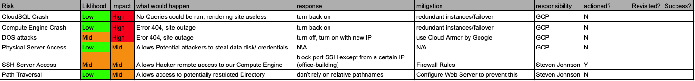 

This is the initial risk matrix, this was determine by risks we could already determine and already resolve. this will be a document that will be iterated throughout the project 

## Gathering User Requirements 

Gathering User Requirements is done via a user story, an example is below:

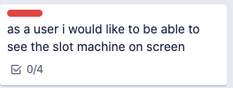

This is then broken up into Tasks by someone in the development team, an example from the above user story is below: 

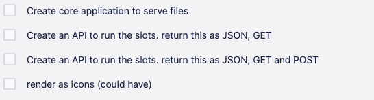

This allows the Development team to work on small features to deliver a desired functionality. 

## High Level Application Design 

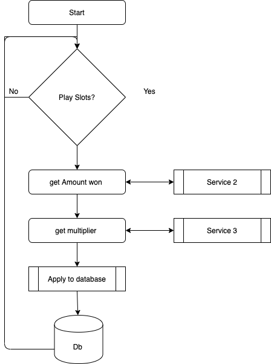

Here is the flowchart for high level overview of the application 

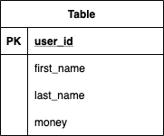

## Entity Diagram

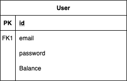

## Main Service Spec 

The Main Service serves the Jinja2 pages to the user, it will then utilise the API's
It will also persist data to the SQL Database 

## Service 2 spec - slot machine Spec 

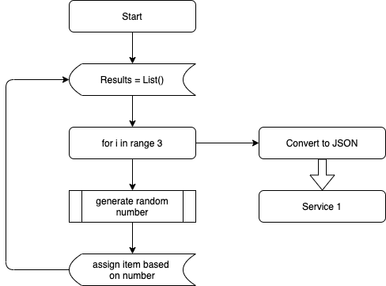

The Slot Machine API will generate 3 results randomly (like a slot machine would normally), it will then give this information to the Main Service for it to be rendered by Jinja2

## Service 3 spec - slot machine multiplier Spec 

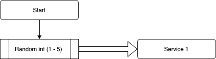

The Slot Machine Multiplier API will determine a random multiplier, at first it will be entirely random however in further iterations this will favour older accounts more than younger ones 

## Service 4 spec - amount calculator

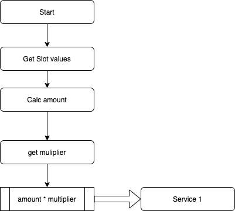

This will then take the information from Service 2 and 3 and work our how much money was won/lost and send this to Service 1 for the database to be updated accordingly 

## CI/CD Pipeline Spec 

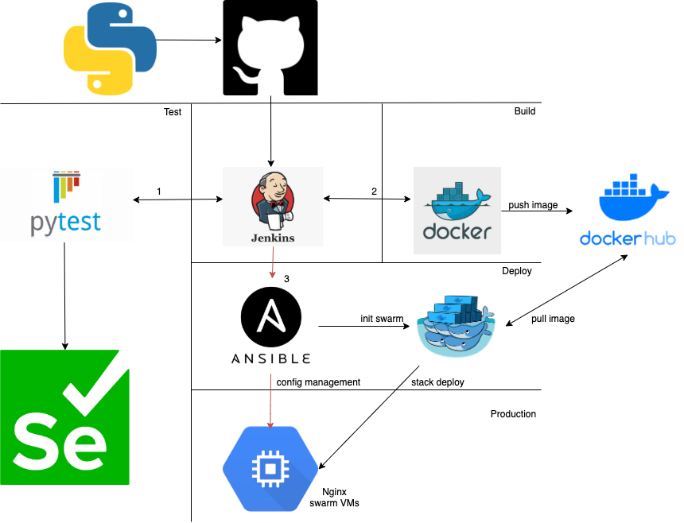

The CI/CD Pipelines will be controlled by the Jenkinsfile 

It will be organised into build -> test -> deploy. 

the build will focus on building the images such as: 

+ 3 Flask Containers (composing the main app + API's)
+ Nginx Container (for reverse proxy)
+ MySQL Container

Testing will utilise multiple technologies as long with methods: 

+ Pytest (mocking API's, unittest)
+ Selenium (Integration Testing)

Deployment will make use of Docker Swarm. This will allow us to build application redundancy. This will also allow us to build rolling updates 

# Sprint 1 

## Trello board to do 

In This Sprint we aim to build the essential software functionality. We Do this by using the MoSCoW method. as you can see below, we have segmented the projects into must have (red), should have (orange) and could have (green).

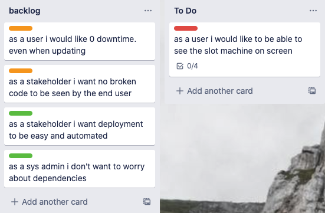

Everything which is red defines the MVP (or Minimum Viable Product), Which means ones this is done the iterations are focussed more on improvement, as you can see from the above image all the must haves should be completed by the end of the first sprint

## Changes

+ Software will be in a working state 

## Test Coverage 

Test 1 Coverage is within the Issues due to a problem discovered during testing. 

Test 2 Coverage is below: 

Test 3 Coverage is below:

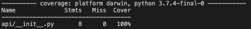

Main Service Coverage is below:

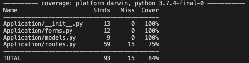

## Issues 

Due to how the application was coded the test will return a different percentage each time. This will be amended in the next sprint

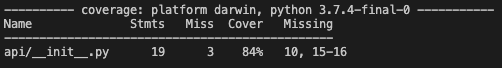

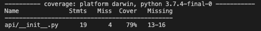

## Risk Assessment 

During This Sprint, Some new errors have became of interest. as well as this some previously known issues have been readdressed. 

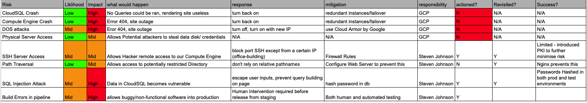

so as you can see we have revisited SSH Access and Path Traversal. SSH Access while Firewalls are effective they can restrict those with legitimate access. with the use of PKI (Public Ket Infrastructure) we can secure our environments while still allowing CI Pipeline Servers to communicate in a way that required no human interaction. 

Due to the Issue we experienced during Testing we have added potentially automation Issues. rather than just dry running the application. in future we will deploy with docker and use Integration tests to ensure no bad code makes its way into a production environment. 

## Success and other changes 

+ Created a CRUD Application, Testing above 80%
+ 3 Micro-Services to compliment the app. Testing 100% (with the exception on Service 1)

## Limitations

+ Due to initial design on service 1 pytest does not provide accurate coverage, While this has been confirmed to work, This Code will require refactoring during the next sprint to amend
+ Due to deployment not yet being implemented. Testing is non-existent within the Main Service. While the test case is written (commented out under Main/Testing/test_unit.py). We cannot confirm functionality. Manual Testing revealed positive results. 

# Refactoring

## API 1 

We decided to refactor this with top priority. due to the the issue found during test 1. 

so the problematic function used to to look like this: 

we changed it to this:

This provided numerous benefits.

+ More Pythonic (easily readable)
+ More efficient
+ Testing Issue Resolved (see below)

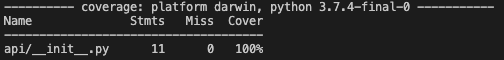